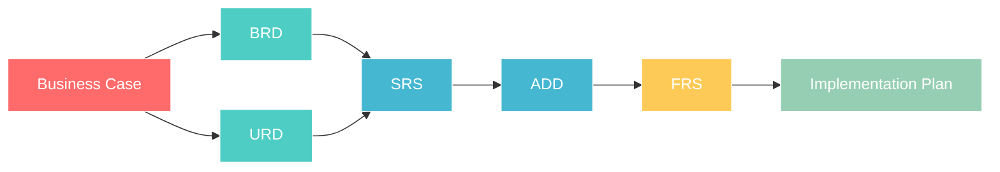

# tets project - Documentation

**📚 Complete AI-SDLC Documentation Suite**

**Author:** Martin Ouimet (mouimet@infinisoft.world)

---

## 🎯 Documentation Overview

This documentation follows the **AI-SDLC methodology**, providing structured templates and workflows for human-AI collaborative development.

---

## 📋 Phase 1: Strategic Planning & Design

### 🔍 Business Analysis (Sarah - AI Business Analyst)

| Document | Purpose | AI Teammate | Status |
|----------|---------|-------------|--------|
| **business-case-template.md** | Problem definition & solution approach | Sarah | 📝 Template Ready |
| **brd-template.md** | Business Requirements Document | Sarah | 📝 Template Ready |
| **urd-template.md** | User Requirements Document | Sarah | 📝 Template Ready |

### 🏗️ Technical Architecture (Alex - AI Architect)

| Document | Purpose | AI Teammate | Status |
|----------|---------|-------------|--------|
| **srs-template.md** | System Requirements Specification | Alex | 📝 Template Ready |
| **add-template.md** | Architectural Design Document | Alex | 📝 Template Ready |

---

## 🔧 Phase 2: Implementation & Delivery

### ⚙️ Functional Design & Implementation

| Document | Purpose | AI Teammate | Status |
|----------|---------|-------------|--------|
| **frs-template.md** | Functional Requirements Specification | Alex | 📝 Template Ready |
| **implementation-plan-template.md** | Development roadmap & milestones | Jordan | 📝 Template Ready |

---

## 🔄 AI-SDLC Workflow Process

### 1. 💬 **Discussion-Based Information Gathering**
- AI teammate initiates collaborative conversation
- Human provides context, requirements, and constraints
- Structured dialogue ensures comprehensive coverage

### 2. 📝 **Template-Based Document Creation**
- AI creates professional deliverable using appropriate template
- Consistent structure and format across all documents
- Built-in traceability and quality checkpoints

### 3. ✅ **Human Review & Approval Gateway**
- Quality assurance and validation by human expert
- Approval required before proceeding to next phase
- Feedback loop for continuous improvement

### 4. 🚀 **Phase Progression**
- Seamless transition to next AI-SDLC phase
- Clear handoffs between AI teammates
- Maintained context and decision history

---

## 📈 Document Traceability Chain

**Traceability ensures:**
- ✅ No requirements are lost between phases
- ✅ All decisions are documented and justified
- ✅ Full audit trail from business case to implementation
- ✅ Easy impact analysis for changes

---

## 🎯 Template Usage Guidelines

### 📋 For Business Analysts (Sarah)
1. **Start with collaborative discussion** to understand business context
2. **Use business-case-template.md** to document problem and solution
3. **Create BRD and URD** based on stakeholder requirements
4. **Ensure human approval** before technical handoff

### 🏗️ For Architects (Alex)  
1. **Review approved business requirements** from Phase 1
2. **Use srs-template.md** for domain-driven system design
3. **Create ADD** with C4 model architecture diagrams
4. **Validate technical decisions** with human expert

### 📊 For Project Managers (Jordan)
1. **Coordinate between AI teammates** and human stakeholders
2. **Track progress** through GitHub project boards
3. **Manage handoffs** between phases
4. **Ensure quality** and timeline adherence

---

## 🔧 Template Customization

All templates include:
- **Variable placeholders** for project-specific information
- **Structured sections** for consistent documentation
- **Traceability links** to previous phase deliverables
- **Approval checkpoints** for quality assurance

---

## 📞 Getting Help

- **GitHub Issues** - For template improvements or questions
- **Project Board** - For current phase status and assignments
- **AI Teammates** - For collaborative document creation

---

**🚀 Ready to Create Professional Documentation?**

*Choose Your Phase • Select AI Teammate • Start Collaborating*

---

