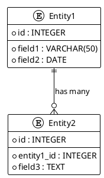
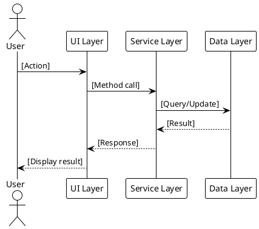
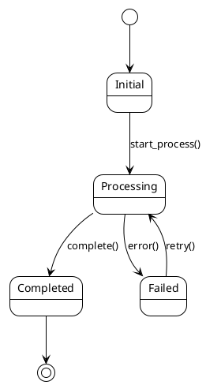
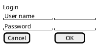

# Functional Requirements Specification (FRS) Template
## Technical Design for Single Functional Requirement

**Project Name:** tets project  
**Functional Requirement:** [FR-DX-XXX from SRS]  
**Date:** 2025-06-19  
**Prepared By:** [Human Name] & [AI Functional Analyst]  

---

## Functional Requirement Overview  

**FR Reference:** [FR-DX-XXX - Functional requirement ID from SRS]  
**Domain:** [Domain name from SRS]  
**Purpose:** [What this functional requirement accomplishes]  

---

## Technical Design

### Core Functionality
**Input → Processing → Output:**
- **Input:** [What data/information goes into the system]  
- **Processing:** [Step-by-step business logic and rules]  
- **Output:** [What the system produces]  

### Business Rules  
1. [Business rule 1 that applies to this functional requirement]  
2. [Business rule 2 that applies to this functional requirement]  
3. [Business rule 3 that applies to this functional requirement]  

---

## Data Design

### Database Schema (if needed)
**Required Tables/Entities:**
| Entity | Purpose | Key Fields |
|--------|---------|------------|
| [Entity 1] | [What it stores] | [Primary key, important fields] |
| [Entity 2] | [What it stores] | [Primary key, important fields] |

### Entity Relationship Diagram (ERD)
**PlantUML ERD Code:**

---

## Process Design (if needed)

### Business Process Flow
**Process Steps:**
1. [Step 1 description]
2. [Step 2 description]
3. [Step 3 description]

### Sequence Diagram (for complex interactions)
**PlantUML Sequence Code:**

---

## State Management (if needed)

### State Diagram (for entities with states)
**PlantUML State Code:**

---

## User Interface Design (if needed)

### UI Components
**Screen/Page:** [UI screen name]
**Components:**
- [Component 1]: [Purpose and behavior]
- [Component 2]: [Purpose and behavior]

### User Interactions
- **User Action:** [What user does] → **System Response:** [What system does]
- **User Action:** [What user does] → **System Response:** [What system does]

### UI Wireframe (if needed)
**PlantUML Wireframe Code:**

**PlantUML Wireframe Reference:**
- **Documentation:** https://pdf.plantuml.net/PlantUML_Language_Reference_Guide_en.pdf#page=336
- **Salt Syntax:** Use `salt` keyword for wireframe creation
- **Components:** Buttons `[OK]`, Text fields `"text"`, Tables `{...}`, etc.

---

## Service Integration (if needed)

### External Services
| Service | Purpose | Integration Method |
|---------|---------|-------------------|
| [Service 1] | [Why needed] | [API/File/Database] |
| [Service 2] | [Why needed] | [API/File/Database] |

### API Design (if providing APIs)
**Endpoint:** [HTTP method and URL]
**Request:** [Request format]
**Response:** [Response format]

---

## Data Migration (if needed)

### Migration Requirements
- **Source:** [Where data comes from]
- **Target:** [Where data goes]
- **Transformation:** [How data is transformed]
- **Validation:** [How to verify migration success]

---

## Acceptance Criteria

### Functional Acceptance Criteria
- [ ] **Given** [initial condition] **When** [user action] **Then** [expected result]
- [ ] **Given** [initial condition] **When** [user action] **Then** [expected result]
- [ ] **Given** [initial condition] **When** [user action] **Then** [expected result]

### Technical Acceptance Criteria
- [ ] Database schema is created and validated
- [ ] All business rules are implemented and tested
- [ ] Integration with external services works correctly
- [ ] UI components function as designed
- [ ] Data migration (if needed) is successful

---

## Implementation Notes

### Technical Considerations
- [Important technical consideration 1]
- [Important technical consideration 2]
- [Important technical consideration 3]

### Dependencies
- [Dependency 1 that must be completed first]
- [Dependency 2 that must be completed first]

### Risks and Mitigation
- **Risk:** [Potential risk] → **Mitigation:** [How to address it]
- **Risk:** [Potential risk] → **Mitigation:** [How to address it]
